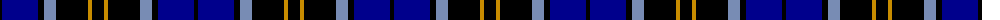
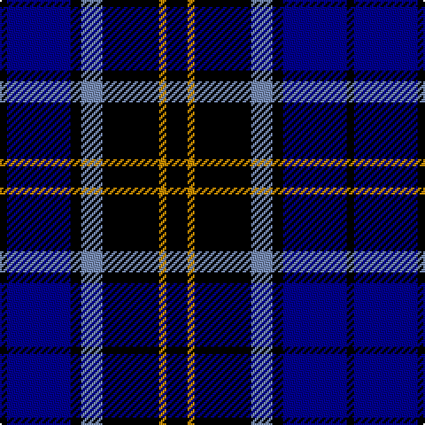

The parent of this is [Carrick High (Corporate)](/tartans/k/4/db36/k6/b12/k32/dy4/k/12/)

This was sourced from tartans-authority.  It is a [7 stripes tartan](/stripes/stripes7/).

Original link http://www.tartansauthority.com/tartan-ferret/display/4145/

## Thread count
K/4 DB36 K6 B12 K32 DY4 K/12

## Palette
Each colour and its ΔE from the base-6 reference it is a variant of.

| Colour | Shade | Base | ΔE (OKLab) |
|---|---|---|---|
| B |  `#788CB4` | B  | 0.25 |
| DB |  `#00008C` | B  | 0.13 |
| DY |  `#C88C00` | Y  | 0.15 |
| K |  `#000000` | K  | 0.00 |

# Sample pattern

ID: /variants/k/4/db36/k6/b12/k32/dy4/k/12-b788cb4-db00008c-dyc88c00-k000000/
