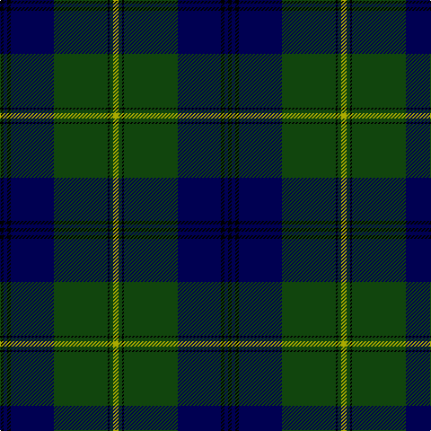

The parent of this is [Johnston](/tartans/k/4/db4/k4/db48/dg60/k2/dg4/lg/6/)

This was sourced from weddslist.  It is a [8 stripes tartan](/stripes/stripes8/).

Original link http://www.weddslist.com/cgi-bin/tartans/pg.pl?source=x

## Thread count
K/4 DB4 K4 DB48 DG60 K2 DG4 LG/6

## Palette
Each colour and its ΔE from the base-6 reference it is a variant of.

| Colour | Shade | Base | ΔE (OKLab) |
|---|---|---|---|
| DB |  `#000052` | B  | 0.20 |
| DG |  `#11450D` | G  | 0.10 |
| K |  `#000000` | K  | 0.00 |
| LG |  `#AAAA00` | Y  | 0.11 |

# Sample pattern

ID: /variants/k/4/db4/k4/db48/dg60/k2/dg4/lg/6-db000052-dg11450d-k000000-lgaaaa00/
