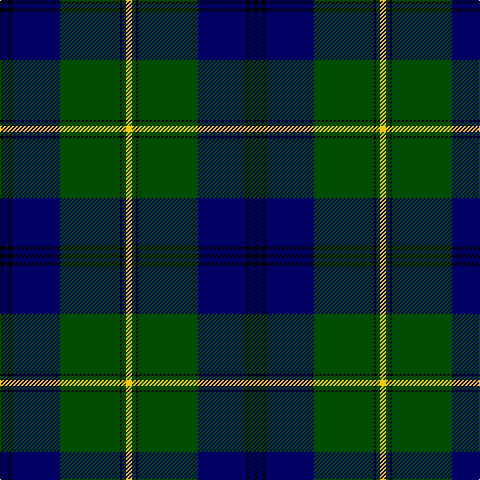

The parent of this is [Johnston](/tartans/k/4/db4/k4/db48/g60/k2/g4/y/6/)

This was sourced from weddslist.  It is a [8 stripes tartan](/stripes/stripes8/).

Original link http://www.weddslist.com/cgi-bin/tartans/pg.pl?source=rb

## Thread count
K/4 DB4 K4 DB48 G60 K2 G4 Y/6

## Palette
Each colour and its ΔE from the base-6 reference it is a variant of.

| Colour | Shade | Base | ΔE (OKLab) |
|---|---|---|---|
| DB |  `#000064` | B  | 0.17 |
| G |  `#004C00` | G  | 0.08 |
| K |  `#000000` | K  | 0.00 |
| Y |  `#FFC800` | Y  | 0.04 |

# Sample pattern

ID: /variants/k/4/db4/k4/db48/g60/k2/g4/y/6-db000064-g004c00-k000000-yffc800/
