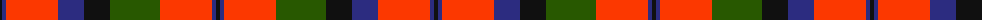

The parent of this is [MacNaughton (Logan) #2](/tartans/k/4/db4/ra52/db26/k26/g50/ra52/db4/k/4/)

This was sourced from register-of-tartans.  It is a [9 stripes tartan](/stripes/stripes9/).

Original link https://www.tartanregister.gov.uk/tartanDetails.aspx?ref=2676

## Thread count
K/4 DB4 Ra52 DB26 K26 G50 Ra52 DB4 K/4

## Palette
Each colour and its ΔE from the base-6 reference it is a variant of.

| Colour | Shade | Base | ΔE (OKLab) |
|---|---|---|---|
| DB |  `#2C2C80` | B  | 0.05 |
| G |  `#285800` | G  | 0.04 |
| K |  `#101010` | K  | 0.17 |
| R |  `#C80000` | R  | 0.00 |
| Ra |  `#FC3800` | R  | 0.12 |

ID: /variants/k/4/db4/ra52/db26/k26/g50/ra52/db4/k/4-db2c2c80-g285800-k101010-rc80000-rafc3800/
