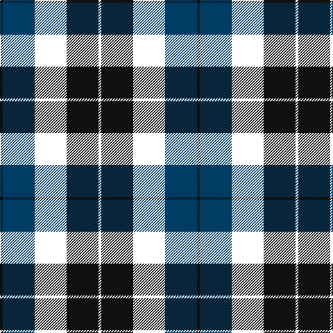

The parent of this is [McTear's Auctioneers](/tartans/k/4/db46/lb46/k46/lb/4/)

This was sourced from register-of-tartans.  It is a [5 stripes tartan](/stripes/stripes5/).

Original link https://www.tartanregister.gov.uk/tartanDetails.aspx?ref=11434

## Thread count
K/4 DB46 LB46 K46 LB/4

## Palette
Each colour and its ΔE from the base-6 reference it is a variant of.

| Colour | Shade | Base | ΔE (OKLab) |
|---|---|---|---|
| DB |  `#003C64` | B  | 0.07 |
| K |  `#101010` | K  | 0.17 |

# Sample pattern

ID: /variants/k/4/db46/lb46/k46/lb/4-db003c64-k101010/
