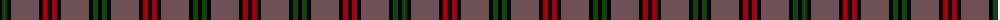
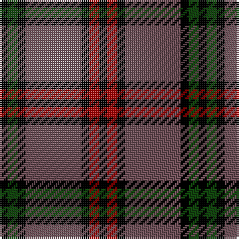

The parent of this is [Montgomery](/tartans/k/4/dg5/k4/n28/k4/dr5/k/4/)

This was sourced from weddslist.  It is a [7 stripes tartan](/stripes/stripes7/).

Original link http://www.weddslist.com/cgi-bin/tartans/pg.pl?source=x

## Thread count
K/4 DG5 K4 N28 K4 DR5 K/4

## Palette
Each colour and its ΔE from the base-6 reference it is a variant of.

| Colour | Shade | Base | ΔE (OKLab) |
|---|---|---|---|
| DG |  `#11450D` | G  | 0.10 |
| DR |  `#AA0000` | R  | 0.06 |
| K |  `#000000` | K  | 0.00 |
| N |  `#6E5058` | B  | 0.14 |

# Sample pattern

ID: /variants/k/4/dg5/k4/n28/k4/dr5/k/4-dg11450d-draa0000-k000000-n6e5058/
