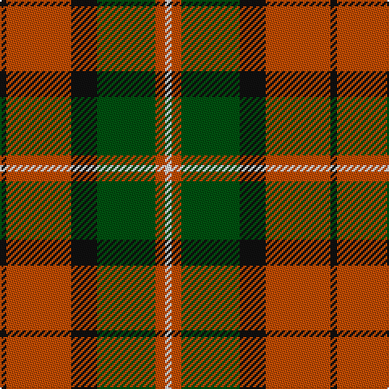

The parent of this is [Celtic Combat](/tartans/k/4/do40/k16/g36/do6/ln/4/)

This was sourced from register-of-tartans.  It is a [6 stripes tartan](/stripes/stripes6/).

Original link https://www.tartanregister.gov.uk/tartanDetails.aspx?ref=604

## Thread count
K/4 DO40 K16 G36 DO6 LN/4

## Palette
Each colour and its ΔE from the base-6 reference it is a variant of.

| Colour | Shade | Base | ΔE (OKLab) |
|---|---|---|---|
| DO |  `#C04C04` | R  | 0.08 |
| G |  `#005010` | G  | 0.07 |
| K |  `#101010` | K  | 0.17 |
| LN |  `#E0E0E0` | W  | 0.06 |

# Sample pattern

ID: /variants/k/4/do40/k16/g36/do6/ln/4-doc04c04-g005010-k101010-lne0e0e0/
