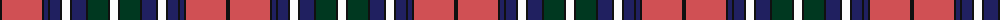

The parent of this is [Unnamed - C19th (Annie Oakley)](/tartans/k/4/do40/k2/db4/k2/db10/k2/w8/k2/db14/k2/dg20/k2/w/8/)

This was sourced from tartans-authority.  It is a [14 stripes tartan](/stripes/stripes14/).

Original link http://www.tartansauthority.com/tartan-ferret/display/8722/

## Thread count
K/4 DO40 K2 DB4 K2 DB10 K2 W8 K2 DB14 K2 DG20 K2 W/8

## Palette
Each colour and its ΔE from the base-6 reference it is a variant of.

| Colour | Shade | Base | ΔE (OKLab) |
|---|---|---|---|
| DB |  `#202060` | B  | 0.11 |
| DG |  `#003820` | G  | 0.16 |
| DO |  `#D05054` | R  | 0.10 |
| K |  `#101010` | K  | 0.17 |
| W |  `#FCFCFC` | W  | 0.03 |

ID: /variants/k/4/do40/k2/db4/k2/db10/k2/w8/k2/db14/k2/dg20/k2/w/8-db202060-dg003820-dod05054-k101010-wfcfcfc/
