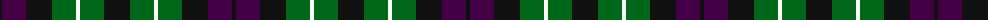

The parent of this is [MacLaggan](/tartans/k/4/dp24/k26/g24/w4/g24/k/26/)

This was sourced from register-of-tartans.  It is a [7 stripes tartan](/stripes/stripes7/).

Original link https://www.tartanregister.gov.uk/tartanDetails.aspx?ref=2589

## Thread count
K/4 DP24 K26 G24 W4 G24 K/26

## Palette
Each colour and its ΔE from the base-6 reference it is a variant of.

| Colour | Shade | Base | ΔE (OKLab) |
|---|---|---|---|
| DP |  `#440044` | B  | 0.17 |
| G |  `#006818` | G  | 0.02 |
| K |  `#101010` | K  | 0.17 |
| W |  `#FFFFFF` | W  | 0.03 |

# Sample pattern

ID: /variants/k/4/dp24/k26/g24/w4/g24/k/26-dp440044-g006818-k101010-wffffff/
