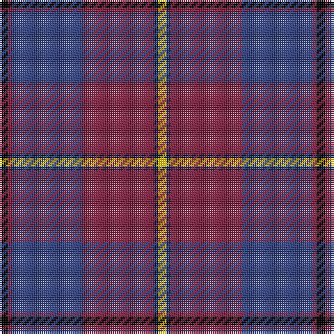

The parent of this is [Murdoch](/tartans/k/4/dr2/b34/dr34/db2/y/4/)

This was sourced from weddslist.  It is a [6 stripes tartan](/stripes/stripes6/).

Original link http://www.weddslist.com/cgi-bin/tartans/pg.pl?source=sts

## Thread count
K/4 DR2 B34 DR34 DB2 Y/4

## Palette
Each colour and its ΔE from the base-6 reference it is a variant of.

| Colour | Shade | Base | ΔE (OKLab) |
|---|---|---|---|
| B |  `#304080` | B  | 0.01 |
| DB |  `#102040` | B  | 0.15 |
| DR |  `#802040` | R  | 0.16 |
| K |  `#000000` | K  | 0.00 |
| Y |  `#F0C000` | Y  | 0.01 |

# Sample pattern

ID: /variants/k/4/dr2/b34/dr34/db2/y/4-b304080-db102040-dr802040-k000000-yf0c000/
