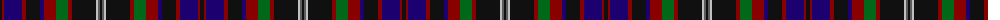

The parent of this is [Oban (District?)](/tartans/k/4/dr2/db18/dr4/k14/db4/dr12/g12/dr4/k24/na2/n2/k/2/)

This was sourced from tartans-authority.  It is a [13 stripes tartan](/stripes/stripes13/).

Original link http://www.tartansauthority.com/tartan-ferret/display/5530/

## Thread count
K/4 DR2 DB18 DR4 K14 DB4 DR12 G12 DR4 K24 Na2 N2 K/2

## Palette
Each colour and its ΔE from the base-6 reference it is a variant of.

| Colour | Shade | Base | ΔE (OKLab) |
|---|---|---|---|
| DB |  `#1C0070` | B  | 0.14 |
| DR |  `#880000` | R  | 0.14 |
| G |  `#006818` | G  | 0.02 |
| K |  `#101010` | K  | 0.17 |
| N |  `#5C5C5C` | B  | 0.14 |
| Na |  `#C0C0C0` | W  | 0.16 |

ID: /variants/k/4/dr2/db18/dr4/k14/db4/dr12/g12/dr4/k24/na2/n2/k/2-db1c0070-dr880000-g006818-k101010-n5c5c5c-nac0c0c0/
