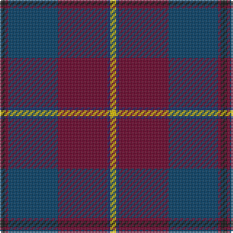

The parent of this is [Murdoch (Name)](/tartans/k/4/dr2/dba34/dr34/db2/y/4/)

This was sourced from tartans-authority.  It is a [6 stripes tartan](/stripes/stripes6/).

Original link http://www.tartansauthority.com/tartan-ferret/display/2525/

## Thread count
K/4 DR2 DBa34 DR34 DB2 Y/4

## Palette
Each colour and its ΔE from the base-6 reference it is a variant of.

| Colour | Shade | Base | ΔE (OKLab) |
|---|---|---|---|
| DB |  `#202060` | B  | 0.11 |
| DBa |  `#003C64` | B  | 0.07 |
| DR |  `#680028` | B  | 0.20 |
| K |  `#101010` | K  | 0.17 |
| Y |  `#E8C000` | Y  | 0.00 |

# Sample pattern

ID: /variants/k/4/dr2/dba34/dr34/db2/y/4-db202060-dba003c64-dr680028-k101010-ye8c000/
