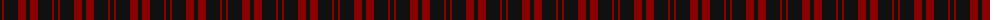
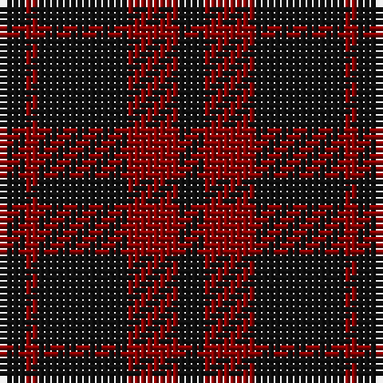

The parent of this is [Romsdal Tresfjord District (Artefact](/tartans/k/4/dr2/k14/dr8/k/4/)

This was sourced from tartans-authority.  It is a [5 stripes tartan](/stripes/stripes5/).

Original link http://www.tartansauthority.com/tartan-ferret/display/2088/

## Thread count
K/4 DR2 K14 DR8 K/4

## Palette
Each colour and its ΔE from the base-6 reference it is a variant of.

| Colour | Shade | Base | ΔE (OKLab) |
|---|---|---|---|
| DR |  `#880000` | R  | 0.14 |
| K |  `#101010` | K  | 0.17 |

# Sample pattern

ID: /variants/k/4/dr2/k14/dr8/k/4-dr880000-k101010/
