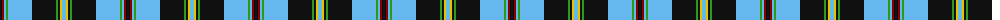

The parent of this is [Kingsbarns Golf Links (Corporate)](/tartans/k/4/dr2/lb2/g2/lb24/k24/g2/k2/y2/lb/4/)

This was sourced from tartans-authority.  It is a [10 stripes tartan](/stripes/stripes10/).

Original link http://www.tartansauthority.com/tartan-ferret/display/2532/

## Thread count
K/4 DR2 LB2 G2 LB24 K24 G2 K2 Y2 LB/4

## Palette
Each colour and its ΔE from the base-6 reference it is a variant of.

| Colour | Shade | Base | ΔE (OKLab) |
|---|---|---|---|
| DR |  `#880000` | R  | 0.14 |
| G |  `#289C18` | G  | 0.18 |
| K |  `#101010` | K  | 0.17 |
| LB |  `#64B8EC` | W  | 0.24 |
| Y |  `#E8C000` | Y  | 0.00 |

ID: /variants/k/4/dr2/lb2/g2/lb24/k24/g2/k2/y2/lb/4-dr880000-g289c18-k101010-lb64b8ec-ye8c000/
