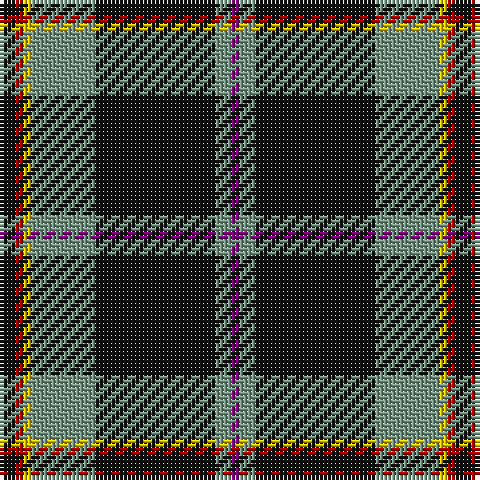

The parent of this is [Coalfields Regeneration Trust, The](/tartans/k/4/dr2/y2/lg16/k30/lg4/p/2/)

This was sourced from tartans-authority.  It is a [7 stripes tartan](/stripes/stripes7/).

Original link http://www.tartansauthority.com/tartan-ferret/display/11015/

## Thread count
K/4 DR2 Y2 LG16 K30 LG4 P/2

## Palette
Each colour and its ΔE from the base-6 reference it is a variant of.

| Colour | Shade | Base | ΔE (OKLab) |
|---|---|---|---|
| DR |  `#A00000` | R  | 0.09 |
| K |  `#101010` | K  | 0.17 |
| LG |  `#789484` | G  | 0.23 |
| P |  `#780078` | B  | 0.16 |
| Y |  `#E8C000` | Y  | 0.00 |

# Sample pattern

ID: /variants/k/4/dr2/y2/lg16/k30/lg4/p/2-dra00000-k101010-lg789484-p780078-ye8c000/
