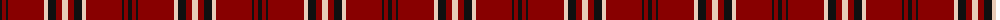
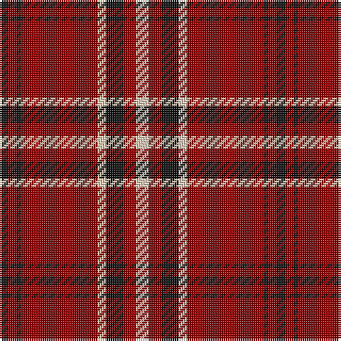

The parent of this is [Lougheed (Name?)](/tartans/k/4/dr4/k2/dr36/lr4/k8/dr6/lr/6/)

This was sourced from tartans-authority.  It is a [8 stripes tartan](/stripes/stripes8/).

Original link http://www.tartansauthority.com/tartan-ferret/display/5932/

## Thread count
K/4 DR4 K2 DR36 LR4 K8 DR6 LR/6

## Palette
Each colour and its ΔE from the base-6 reference it is a variant of.

| Colour | Shade | Base | ΔE (OKLab) |
|---|---|---|---|
| DR |  `#880000` | R  | 0.14 |
| K |  `#101010` | K  | 0.17 |
| LR |  `#E8CCB8` | W  | 0.11 |

# Sample pattern

ID: /variants/k/4/dr4/k2/dr36/lr4/k8/dr6/lr/6-dr880000-k101010-lre8ccb8/
