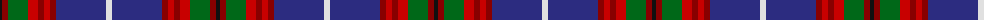

The parent of this is [Edinburgh District Tartan Tartan Number: 1163. Earliest known date: 1970 Several attempts have been made to develop a special tartan for the residents of Edinburgh. None had success until the design by Councillor Hugh Macpherson in 1970 on the occassion of the Commonwealth Games. The colours have symbolic references to the City of Edinburgh. See products available Copyright © Blair Urquhart, Comrie, 2015](/tartans/k/4/dr6/g20/r10/dr6/r6/dr6/db50/ln/6/)

This was sourced from house-of-tartan.  It is a [9 stripes tartan](/stripes/stripes9/).

Original link http://www.house-of-tartan.scotland.net/house/TartanViewjs.asp?colr=Def&tnam=1163

## Thread count
K/4 DR6 G20 R10 DR6 R6 DR6 DB50 LN/6

## Palette
Each colour and its ΔE from the base-6 reference it is a variant of.

| Colour | Shade | Base | ΔE (OKLab) |
|---|---|---|---|
| DB |  `#2C2C80` | B  | 0.05 |
| DR |  `#880000` | R  | 0.14 |
| G |  `#006818` | G  | 0.02 |
| K |  `#101010` | K  | 0.17 |
| LN |  `#E0E0E0` | W  | 0.06 |
| R |  `#C80000` | R  | 0.00 |

ID: /variants/k/4/dr6/g20/r10/dr6/r6/dr6/db50/ln/6-db2c2c80-dr880000-g006818-k101010-lne0e0e0-rc80000/
