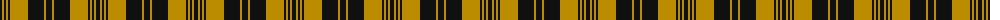

The parent of this is [Justus Black & Gold (Angus) (Persona](/tartans/k/4/dy2/k2/dy2/k2/dy18/k16/dy2/k/6/)

This was sourced from tartans-authority.  It is a [9 stripes tartan](/stripes/stripes9/).

Original link http://www.tartansauthority.com/tartan-ferret/display/2732/

## Thread count
K/4 DY2 K2 DY2 K2 DY18 K16 DY2 K/6

## Palette
Each colour and its ΔE from the base-6 reference it is a variant of.

| Colour | Shade | Base | ΔE (OKLab) |
|---|---|---|---|
| DY |  `#BC8C00` | Y  | 0.16 |
| K |  `#101010` | K  | 0.17 |

ID: /variants/k/4/dy2/k2/dy2/k2/dy18/k16/dy2/k/6-dybc8c00-k101010/
