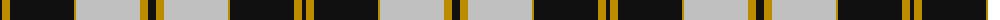
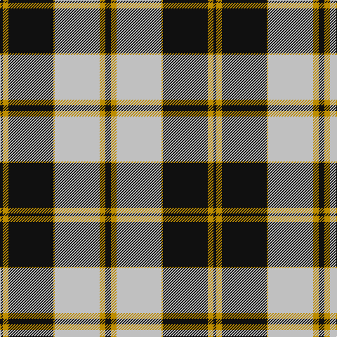

The parent of this is [Gleneagles Gold (Corporate)](/tartans/k/4/dy8/k64/dy2/n64/dy8/k/8/)

This was sourced from tartans-authority.  It is a [7 stripes tartan](/stripes/stripes7/).

Original link http://www.tartansauthority.com/tartan-ferret/display/1269/

## Thread count
K/4 DY8 K64 DY2 N64 DY8 K/8

## Palette
Each colour and its ΔE from the base-6 reference it is a variant of.

| Colour | Shade | Base | ΔE (OKLab) |
|---|---|---|---|
| DY |  `#BC8C00` | Y  | 0.16 |
| K |  `#101010` | K  | 0.17 |
| N |  `#C0C0C0` | W  | 0.16 |

# Sample pattern

ID: /variants/k/4/dy8/k64/dy2/n64/dy8/k/8-dybc8c00-k101010-nc0c0c0/
