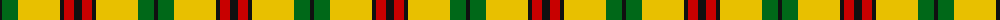
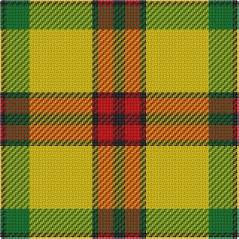

The parent of this is [MacDuck Final version Corporate Tartan Tartan Number: 1121. Earliest known date: 1942 Ancient MacDuck, old colours, as worn by Scrooge MacDuck, uncle to the famous cartoon character Donald Duck and great uncle to Huey, Duey and Luey. See products available Copyright © Blair Urquhart, Comrie, 2015](/tartans/k/4/g16/y42/k4/r10/k/8/)

This was sourced from house-of-tartan.  It is a [6 stripes tartan](/stripes/stripes6/).

Original link http://www.house-of-tartan.scotland.net/house/TartanViewjs.asp?colr=Def&tnam=1121

## Thread count
K/4 G16 Y42 K4 R10 K/8

## Palette
Each colour and its ΔE from the base-6 reference it is a variant of.

| Colour | Shade | Base | ΔE (OKLab) |
|---|---|---|---|
| G |  `#006818` | G  | 0.02 |
| K |  `#101010` | K  | 0.17 |
| R |  `#C80000` | R  | 0.00 |
| Y |  `#E8C000` | Y  | 0.00 |

# Sample pattern

ID: /variants/k/4/g16/y42/k4/r10/k/8-g006818-k101010-rc80000-ye8c000/
