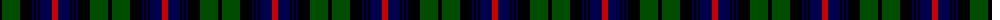

The parent of this is [Urquhart D](/tartans/k/4/g18/k12/db2/k2/db2/k2/db12/r/6/)

This was sourced from weddslist.  It is a [9 stripes tartan](/stripes/stripes9/).

Original link http://www.weddslist.com/cgi-bin/tartans/pg.pl?source=rb

## Thread count
K/4 G18 K12 DB2 K2 DB2 K2 DB12 R/6

## Palette
Each colour and its ΔE from the base-6 reference it is a variant of.

| Colour | Shade | Base | ΔE (OKLab) |
|---|---|---|---|
| DB |  `#00004C` | B  | 0.21 |
| G |  `#004C00` | G  | 0.08 |
| K |  `#000000` | K  | 0.00 |
| R |  `#C80000` | R  | 0.00 |

ID: /variants/k/4/g18/k12/db2/k2/db2/k2/db12/r/6-db00004c-g004c00-k000000-rc80000/
