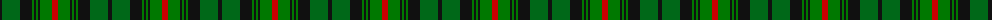

The parent of this is [Urquhart](/tartans/k/4/g18/k12/ga2/k2/ga2/k2/ga12/r/6/)

This was sourced from register-of-tartans.  It is a [9 stripes tartan](/stripes/stripes9/).

Original link https://www.tartanregister.gov.uk/tartanDetails.aspx?ref=4431

## Thread count
K/4 G18 K12 Ga2 K2 Ga2 K2 Ga12 R/6

## Palette
Each colour and its ΔE from the base-6 reference it is a variant of.

| Colour | Shade | Base | ΔE (OKLab) |
|---|---|---|---|
| G |  `#006818` | G  | 0.02 |
| Ga |  `#007800` | G  | 0.06 |
| K |  `#101010` | K  | 0.17 |
| R |  `#C80000` | R  | 0.00 |

ID: /variants/k/4/g18/k12/ga2/k2/ga2/k2/ga12/r/6-g006818-ga007800-k101010-rc80000/
