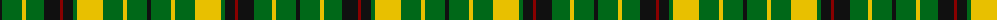

The parent of this is [Greenshields Personal Tartan Tartan Number: 5115. Earliest known date: 1997 Designed by Peter MacDoanld in 1997 for Alan Greenshields, Glasgow as a family tartan. Based by request of the customer on the MacNichol given by both Ross-Craven and Robert Bain but using yellow form the MacLeod. See products available Copyright © Blair Urquhart, Comrie, 2015](/tartans/k/4/g20/y4/g18/k16/dr3/k10/g4/y26/g20/y4/g20/k/4/)

This was sourced from house-of-tartan.  It is a [13 stripes tartan](/stripes/stripes13/).

Original link http://www.house-of-tartan.scotland.net/house/TartanViewjs.asp?colr=Def&tnam=5115

## Thread count
K/4 G20 Y4 G18 K16 DR3 K10 G4 Y26 G20 Y4 G20 K/4

## Palette
Each colour and its ΔE from the base-6 reference it is a variant of.

| Colour | Shade | Base | ΔE (OKLab) |
|---|---|---|---|
| DR |  `#880000` | R  | 0.14 |
| G |  `#006818` | G  | 0.02 |
| K |  `#101010` | K  | 0.17 |
| Y |  `#E8C000` | Y  | 0.00 |

ID: /variants/k/4/g20/y4/g18/k16/dr3/k10/g4/y26/g20/y4/g20/k/4-dr880000-g006818-k101010-ye8c000/
