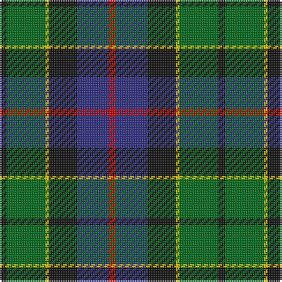

The parent of this is [Forsyth Clan Tartan Tartan Number: 1122. Earliest known date: 1872 (1830) This sett has a close resemblance to the the Leslie tartan in which white replaces yellow. A description of the tartan appears in Jennie Forsyth Jeffrie's 'History of the Forsyth Family' (1918). Clan Chief, Alistair Forsyth, was recognised by Lord Lyon in 1978 - the first for over 300 years. See products available Copyright © Blair Urquhart, Comrie, 2015](/tartans/k/4/g22/y2/k16/db18/r/4/)

This was sourced from house-of-tartan.  It is a [6 stripes tartan](/stripes/stripes6/).

Original link http://www.house-of-tartan.scotland.net/house/TartanViewjs.asp?colr=Def&tnam=1122

## Thread count
K/4 G22 Y2 K16 DB18 R/4

## Palette
Each colour and its ΔE from the base-6 reference it is a variant of.

| Colour | Shade | Base | ΔE (OKLab) |
|---|---|---|---|
| DB |  `#2C2C80` | B  | 0.05 |
| G |  `#006818` | G  | 0.02 |
| K |  `#101010` | K  | 0.17 |
| R |  `#C80000` | R  | 0.00 |
| Y |  `#E8C000` | Y  | 0.00 |

# Sample pattern

ID: /variants/k/4/g22/y2/k16/db18/r/4-db2c2c80-g006818-k101010-rc80000-ye8c000/
