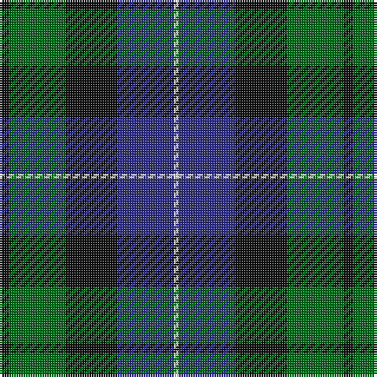

The parent of this is [MacKirdy Family Tartan Tartan Number: 1092. Earliest known date: 1930-50 This sample comes from the MacGregor-Hastie collection which forms the basis of the cloth archive of the Scottish Tartans Society. MacGregor-Hastie noted, "A pattern seen at Andersons, Edinburgh, was labelled 'MacKirdy'. It is a simple green tartan. The family are usually given as a sept of the Stuarts of Bute. The tartan is modern". One can assume that the sample dates between 1930 and 1950. At a very early period the larger part of the Island of Bute belonged to the Mackuerdys, which was leased to them by King James IV in 1489. Later Bute became the stronghold of the Stuarts of Bute. See products available Copyright © Blair Urquhart, Comrie, 2015](/tartans/k/4/g24/k22/db24/ln/2/)

This was sourced from house-of-tartan.  It is a [5 stripes tartan](/stripes/stripes5/).

Original link http://www.house-of-tartan.scotland.net/house/TartanViewjs.asp?colr=Def&tnam=1092

## Thread count
K/4 G24 K22 DB24 LN/2

## Palette
Each colour and its ΔE from the base-6 reference it is a variant of.

| Colour | Shade | Base | ΔE (OKLab) |
|---|---|---|---|
| DB |  `#2C2C80` | B  | 0.05 |
| G |  `#006818` | G  | 0.02 |
| K |  `#101010` | K  | 0.17 |
| LN |  `#E0E0E0` | W  | 0.06 |

# Sample pattern

ID: /variants/k/4/g24/k22/db24/ln/2-db2c2c80-g006818-k101010-lne0e0e0/
