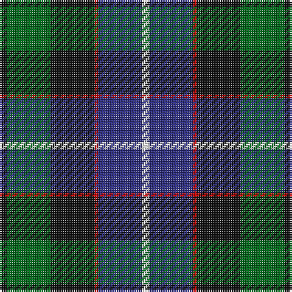

The parent of this is [Galbraith Clan Tartan Tartan Number: 3176. Earliest known date: 1815 It seems certain that the tartan was first known as Galbraith. John Telfer Dunbar states that he has a record of a Hunter tartan designed by a gentleman of the name Hunter in 1824 but without a thread count. Wilson recorded it as Russell in 1847. Galbraiths ('Briton's son in Gaelic) are connected with the Earls of Lennox, and at one time took protection as a Sept of Clan Donald. The name Galbraith is associated with the West Coast island of Gigha. See products available Copyright © Blair Urquhart, Comrie, 2015](/tartans/k/4/g24/k24/r2/db24/ln/4/)

This was sourced from house-of-tartan.  It is a [6 stripes tartan](/stripes/stripes6/).

Original link http://www.house-of-tartan.scotland.net/house/TartanViewjs.asp?colr=Def&tnam=3176

## Thread count
K/4 G24 K24 R2 DB24 LN/4

## Palette
Each colour and its ΔE from the base-6 reference it is a variant of.

| Colour | Shade | Base | ΔE (OKLab) |
|---|---|---|---|
| DB |  `#2C2C80` | B  | 0.05 |
| G |  `#006818` | G  | 0.02 |
| K |  `#101010` | K  | 0.17 |
| LN |  `#E0E0E0` | W  | 0.06 |
| R |  `#C80000` | R  | 0.00 |

# Sample pattern

ID: /variants/k/4/g24/k24/r2/db24/ln/4-db2c2c80-g006818-k101010-lne0e0e0-rc80000/
