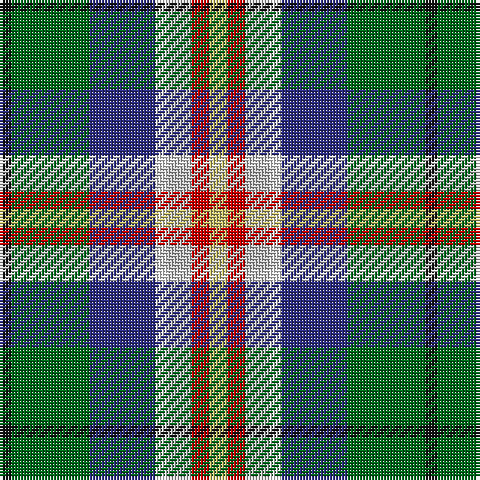

The parent of this is [Kentucky, State of (District)](/tartans/k/4/g26/db22/w4/n8/r6/lg/6/)

This was sourced from tartans-authority.  It is a [7 stripes tartan](/stripes/stripes7/).

Original link http://www.tartansauthority.com/tartan-ferret/display/2667/

## Thread count
K/4 G26 DB22 W4 N8 R6 LG/6

## Palette
Each colour and its ΔE from the base-6 reference it is a variant of.

| Colour | Shade | Base | ΔE (OKLab) |
|---|---|---|---|
| DB |  `#2C2C80` | B  | 0.05 |
| G |  `#006818` | G  | 0.02 |
| K |  `#101010` | K  | 0.17 |
| LG |  `#C4BC68` | Y  | 0.07 |
| N |  `#C0C0C0` | W  | 0.16 |
| R |  `#C80000` | R  | 0.00 |
| W |  `#FCFCFC` | W  | 0.03 |

# Sample pattern

ID: /variants/k/4/g26/db22/w4/n8/r6/lg/6-db2c2c80-g006818-k101010-lgc4bc68-nc0c0c0-rc80000-wfcfcfc/
