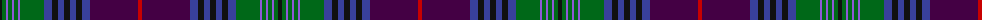

The parent of this is [Rendell, Charles (Personal)](/tartans/k/4/g4/p2/g4/p2/g4/p2/g24/b8/k6/b6/k6/b6/k6/b8/dp48/r/4/)

This was sourced from tartans-authority.  It is a [17 stripes tartan](/stripes/stripes17/).

Original link http://www.tartansauthority.com/tartan-ferret/display/10699/

## Thread count
K/4 G4 P2 G4 P2 G4 P2 G24 B8 K6 B6 K6 B6 K6 B8 DP48 R/4

## Palette
Each colour and its ΔE from the base-6 reference it is a variant of.

| Colour | Shade | Base | ΔE (OKLab) |
|---|---|---|---|
| B |  `#38409C` | B  | 0.04 |
| DP |  `#440044` | B  | 0.17 |
| G |  `#006818` | G  | 0.02 |
| K |  `#101010` | K  | 0.17 |
| P |  `#9058D8` | B  | 0.22 |
| R |  `#C80000` | R  | 0.00 |

ID: /variants/k/4/g4/p2/g4/p2/g4/p2/g24/b8/k6/b6/k6/b6/k6/b8/dp48/r/4-b38409c-dp440044-g006818-k101010-p9058d8-rc80000/
