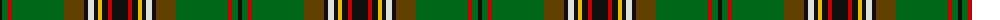

The parent of this is [Tara Murphy Irish Family Tartan Tartan Number: 1103. Earliest known date: 1880 This pattern was recorded by Bill Johnston, Shippak, USA in 1978 along with other patterns found at Pendleton Mill. This and other Irish patterns appear to have originated in the former Waterford Mill in Ireland before they arrived at Pendleton in the late 19C. This and the O'Keefe (1176) are colour variations of the MacLean of Duart See products available Copyright © Blair Urquhart, Comrie, 2015](/tartans/k/4/g6/r4/g52/t20/k4/ln6/k4/y4/k6/r4/k/16/)

This was sourced from house-of-tartan.  It is a [12 stripes tartan](/stripes/stripes12/).

Original link http://www.house-of-tartan.scotland.net/house/TartanViewjs.asp?colr=Def&tnam=1103

## Thread count
K/4 G6 R4 G52 T20 K4 LN6 K4 Y4 K6 R4 K/16

## Palette
Each colour and its ΔE from the base-6 reference it is a variant of.

| Colour | Shade | Base | ΔE (OKLab) |
|---|---|---|---|
| G |  `#006818` | G  | 0.02 |
| K |  `#101010` | K  | 0.17 |
| LN |  `#E0E0E0` | W  | 0.06 |
| R |  `#C80000` | R  | 0.00 |
| T |  `#604000` | G  | 0.14 |
| Y |  `#E8C000` | Y  | 0.00 |

ID: /variants/k/4/g6/r4/g52/t20/k4/ln6/k4/y4/k6/r4/k/16-g006818-k101010-lne0e0e0-rc80000-t604000-ye8c000/
