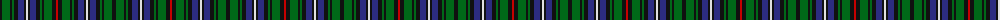

The parent of this is [MacKean dress Family/Clan Tartan Tartan Number: 2339. Earliest known date: 1995 This was designed as a special design for silk squares woven by D C Dalgliesh. Assumption is that all these New Zealand MacKeans are Personal tartans rather than Clan/Family. See products available Copyright © Blair Urquhart, Comrie, 2015](/tartans/k/4/ga8/k2/ga2/k4/db6/k2/ln2/k2/db6/k4/ga2/k2/ga8/k4/r/2/)

This was sourced from house-of-tartan.  It is a [16 stripes tartan](/stripes/stripes16/).

Original link http://www.house-of-tartan.scotland.net/house/TartanViewjs.asp?colr=Def&tnam=2339

## Thread count
K/4 Ga8 K2 Ga2 K4 DB6 K2 LN2 K2 DB6 K4 Ga2 K2 Ga8 K4 R/2

## Palette
Each colour and its ΔE from the base-6 reference it is a variant of.

| Colour | Shade | Base | ΔE (OKLab) |
|---|---|---|---|
| DB |  `#2C2C80` | B  | 0.05 |
| G |  `#285800` | G  | 0.04 |
| Ga |  `#006818` | G  | 0.02 |
| K |  `#101010` | K  | 0.17 |
| LN |  `#E0E0E0` | W  | 0.06 |
| R |  `#C80000` | R  | 0.00 |

ID: /variants/k/4/ga8/k2/ga2/k4/db6/k2/ln2/k2/db6/k4/ga2/k2/ga8/k4/r/2-db2c2c80-g285800-ga006818-k101010-lne0e0e0-rc80000/
