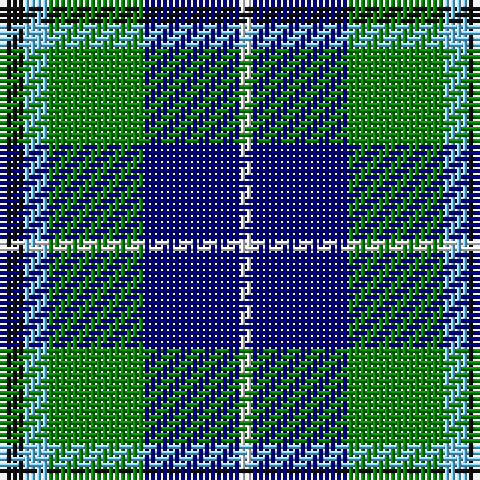

The parent of this is [Douglas](/tartans/k/4/lb4/g16/db16/w/2/)

This was sourced from register-of-tartans.  It is a [5 stripes tartan](/stripes/stripes5/).

Original link https://www.tartanregister.gov.uk/tartanDetails.aspx?ref=4695

## Thread count
K/4 LB4 G16 DB16 W/2

## Palette
Each colour and its ΔE from the base-6 reference it is a variant of.

| Colour | Shade | Base | ΔE (OKLab) |
|---|---|---|---|
| DB |  `#000080` | B  | 0.14 |
| G |  `#008B00` | G  | 0.12 |
| K |  `#101010` | K  | 0.17 |
| LB |  `#82CFFD` | W  | 0.18 |
| W |  `#FFFFFF` | W  | 0.03 |

# Sample pattern

ID: /variants/k/4/lb4/g16/db16/w/2-db000080-g008b00-k101010-lb82cffd-wffffff/
