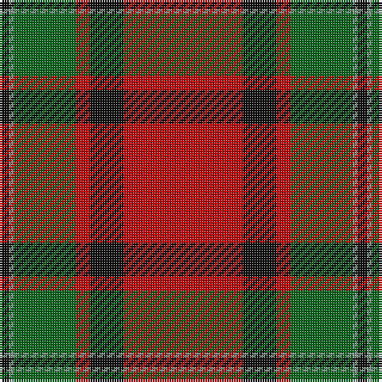

The parent of this is [MacPhail (Clan)](/tartans/k/4/lg2/g26/r6/k14/r/50/)

This was sourced from tartans-authority.  It is a [6 stripes tartan](/stripes/stripes6/).

Original link http://www.tartansauthority.com/tartan-ferret/display/1031/

## Thread count
K/4 LG2 G26 R6 K14 R/50

## Palette
Each colour and its ΔE from the base-6 reference it is a variant of.

| Colour | Shade | Base | ΔE (OKLab) |
|---|---|---|---|
| G |  `#006818` | G  | 0.02 |
| K |  `#101010` | K  | 0.17 |
| LG |  `#789484` | G  | 0.23 |
| R |  `#C80000` | R  | 0.00 |

# Sample pattern

ID: /variants/k/4/lg2/g26/r6/k14/r/50-g006818-k101010-lg789484-rc80000/
