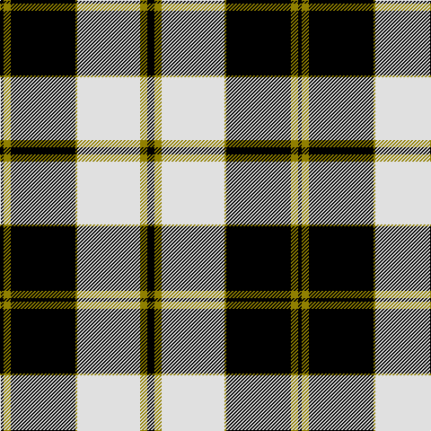

The parent of this is [Gleneagles, Hotel](/tartans/k/4/lg8/k72/lg2/ln70/lg8/k/8/)

This was sourced from weddslist.  It is a [7 stripes tartan](/stripes/stripes7/).

Original link http://www.weddslist.com/cgi-bin/tartans/pg.pl?source=sts

## Thread count
K/4 LG8 K72 LG2 LN70 LG8 K/8

## Palette
Each colour and its ΔE from the base-6 reference it is a variant of.

| Colour | Shade | Base | ΔE (OKLab) |
|---|---|---|---|
| K |  `#000000` | K  | 0.00 |
| LG |  `#908000` | G  | 0.19 |
| LN |  `#E0E0E0` | W  | 0.06 |

# Sample pattern

ID: /variants/k/4/lg8/k72/lg2/ln70/lg8/k/8-k000000-lg908000-lne0e0e0/
