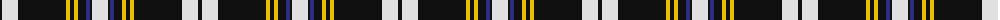

The parent of this is [Newcastle](/tartans/k/4/ln16/k48/y4/k4/y4/k8/db4/k2/ln/16/)

This was sourced from register-of-tartans.  It is a [10 stripes tartan](/stripes/stripes10/).

Original link https://www.tartanregister.gov.uk/tartanDetails.aspx?ref=3126

## Thread count
K/4 LN16 K48 Y4 K4 Y4 K8 DB4 K2 LN/16

## Palette
Each colour and its ΔE from the base-6 reference it is a variant of.

| Colour | Shade | Base | ΔE (OKLab) |
|---|---|---|---|
| DB |  `#2C2C80` | B  | 0.05 |
| K |  `#101010` | K  | 0.17 |
| LN |  `#E0E0E0` | W  | 0.06 |
| Y |  `#E8C000` | Y  | 0.00 |

ID: /variants/k/4/ln16/k48/y4/k4/y4/k8/db4/k2/ln/16-db2c2c80-k101010-lne0e0e0-ye8c000/
