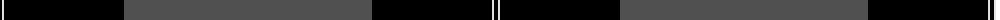
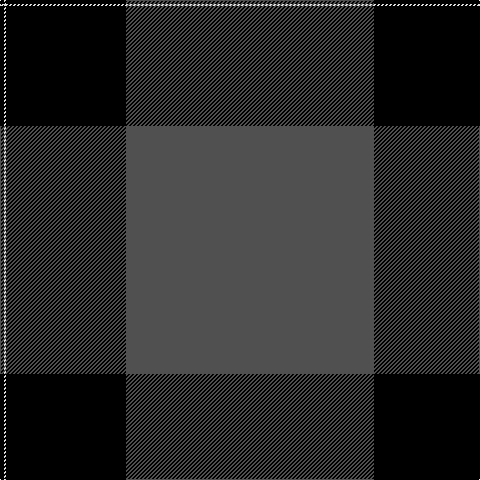

The parent of this is [Pride of New Zealand, The](/tartans/k/4/ln2/k120/n/248/)

This was sourced from weddslist.  It is a [4 stripes tartan](/stripes/stripes4/).

Original link http://www.weddslist.com/cgi-bin/tartans/pg.pl?source=sts

## Thread count
K/4 LN2 K120 N/248

## Palette
Each colour and its ΔE from the base-6 reference it is a variant of.

| Colour | Shade | Base | ΔE (OKLab) |
|---|---|---|---|
| K |  `#000000` | K  | 0.00 |
| LN |  `#E0E0E0` | W  | 0.06 |
| N |  `#505050` | B  | 0.12 |

# Sample pattern

ID: /variants/k/4/ln2/k120/n/248-k000000-lne0e0e0-n505050/
