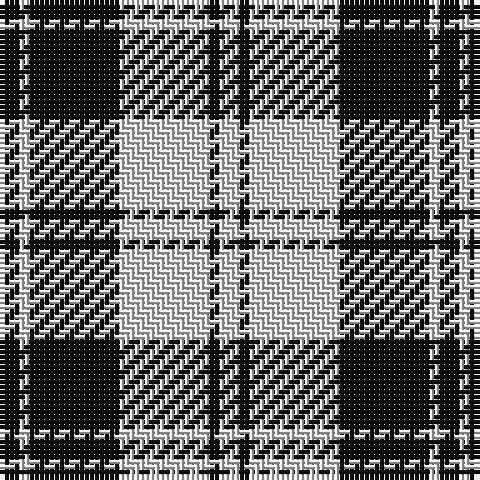

The parent of this is [Erskine BW or Ramsay Clan Tartan Tartan Number: 1246. Earliest known date: pre 2003 Possibly a dress tartan based on the sett recorded in the Vestiarium Scoticum in 1842. The tartan is manufactured by Dalgliesh of Selkirk. See products available Copyright © Blair Urquhart, Comrie, 2015](/tartans/k/4/ln2/k18/ln18/k2/ln/4/)

This was sourced from house-of-tartan.  It is a [6 stripes tartan](/stripes/stripes6/).

Original link http://www.house-of-tartan.scotland.net/house/TartanViewjs.asp?colr=Def&tnam=1246

## Thread count
K/4 LN2 K18 LN18 K2 LN/4

## Palette
Each colour and its ΔE from the base-6 reference it is a variant of.

| Colour | Shade | Base | ΔE (OKLab) |
|---|---|---|---|
| K |  `#101010` | K  | 0.17 |
| LN |  `#E0E0E0` | W  | 0.06 |

# Sample pattern

ID: /variants/k/4/ln2/k18/ln18/k2/ln/4-k101010-lne0e0e0/
