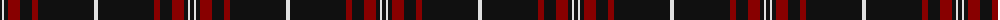

The parent of this is [Brockton (Corporate)](/tartans/k/4/ln2/k4/dr12/k12/dr6/k56/ln/4/)

This was sourced from tartans-authority.  It is a [8 stripes tartan](/stripes/stripes8/).

Original link http://www.tartansauthority.com/tartan-ferret/display/6444/

## Thread count
K/4 LN2 K4 DR12 K12 DR6 K56 LN/4

## Palette
Each colour and its ΔE from the base-6 reference it is a variant of.

| Colour | Shade | Base | ΔE (OKLab) |
|---|---|---|---|
| DR |  `#880000` | R  | 0.14 |
| K |  `#101010` | K  | 0.17 |
| LN |  `#E0E0E0` | W  | 0.06 |

# Sample pattern

ID: /variants/k/4/ln2/k4/dr12/k12/dr6/k56/ln/4-dr880000-k101010-lne0e0e0/
