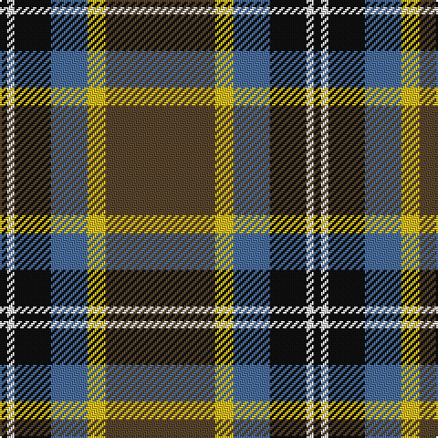

The parent of this is [Bryan Wedding Commemorative Tartan Tartan Number: 10502. Earliest known date: 22/02/2011 Designed for the marriage of Christian Bryan and Mairi Cowieson. The colours are a combination of those contained in the Ramsay and Cornish tartans, reflecting the bride's family connection to the Ramsay tartan and the groom's residence in Cornwall. The autumnal theme of the wedding began with the cognac diamond contained in the brides engagement ring and is further enhanced by the colours chosen for the tartan. See products available Copyright © Blair Urquhart, Comrie, 2015](/tartans/k/4/ln4/k20/b20/y10/t/60/)

This was sourced from house-of-tartan.  It is a [6 stripes tartan](/stripes/stripes6/).

Original link http://www.house-of-tartan.scotland.net/house/TartanViewjs.asp?colr=Def&tnam=10502

## Thread count
K/4 LN4 K20 B20 Y10 T/60

## Palette
Each colour and its ΔE from the base-6 reference it is a variant of.

| Colour | Shade | Base | ΔE (OKLab) |
|---|---|---|---|
| B |  `#486C9C` | B  | 0.14 |
| K |  `#101010` | K  | 0.17 |
| LN |  `#E8E8E8` | W  | 0.04 |
| T |  `#58442C` | G  | 0.14 |
| Y |  `#DCBC1C` | Y  | 0.02 |

# Sample pattern

ID: /variants/k/4/ln4/k20/b20/y10/t/60-b486c9c-k101010-lne8e8e8-t58442c-ydcbc1c/
