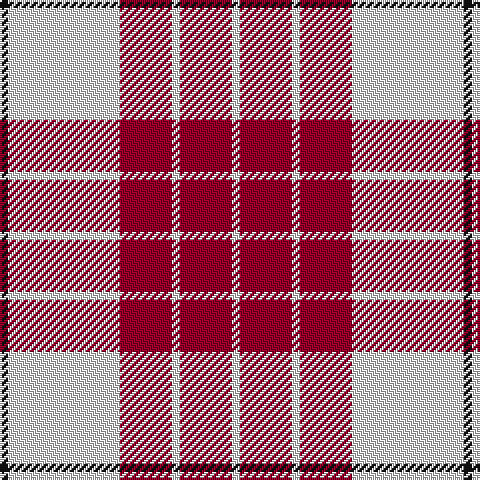

The parent of this is [Buchanan #5](/tartans/k/4/ln56/dr26/ln4/dr26/ln/4/)

This was sourced from register-of-tartans.  It is a [6 stripes tartan](/stripes/stripes6/).

Original link https://www.tartanregister.gov.uk/tartanDetails.aspx?ref=418

## Thread count
K/4 LN56 DR26 LN4 DR26 LN/4

## Palette
Each colour and its ΔE from the base-6 reference it is a variant of.

| Colour | Shade | Base | ΔE (OKLab) |
|---|---|---|---|
| DR |  `#960028` | R  | 0.11 |
| K |  `#101010` | K  | 0.17 |
| LN |  `#E0E0E0` | W  | 0.06 |

# Sample pattern

ID: /variants/k/4/ln56/dr26/ln4/dr26/ln/4-dr960028-k101010-lne0e0e0/
