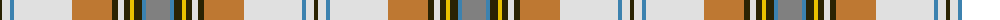

The parent of this is [MacLean of Duart (Reproduction Colours)](/tartans/k/4/ln8/b4/ln58/do40/k6/ln6/k6/y4/k8/b4/n/24/)

This was sourced from register-of-tartans.  It is a [12 stripes tartan](/stripes/stripes12/).

Original link https://www.tartanregister.gov.uk/tartanDetails.aspx?ref=2611

## Thread count
K/4 LN8 B4 LN58 DO40 K6 LN6 K6 Y4 K8 B4 N/24

## Palette
Each colour and its ΔE from the base-6 reference it is a variant of.

| Colour | Shade | Base | ΔE (OKLab) |
|---|---|---|---|
| B |  `#3C82AF` | B  | 0.20 |
| DO |  `#BE7832` | R  | 0.17 |
| K |  `#2A2303` | B  | 0.21 |
| LN |  `#E0E0E0` | W  | 0.06 |
| N |  `#808080` | G  | 0.22 |
| Y |  `#E8C000` | Y  | 0.00 |

ID: /variants/k/4/ln8/b4/ln58/do40/k6/ln6/k6/y4/k8/b4/n/24-b3c82af-dobe7832-k2a2303-lne0e0e0-n808080-ye8c000/
