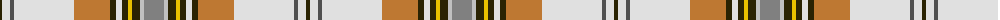

The parent of this is [MacLean of Duart Dress #4](/tartans/k/4/ln8/nb4/ln60/do36/k6/ln6/k6/y4/k8/na4/n/20/)

This was sourced from register-of-tartans.  It is a [12 stripes tartan](/stripes/stripes12/).

Original link https://www.tartanregister.gov.uk/tartanDetails.aspx?ref=2615

## Thread count
K/4 LN8 Nb4 LN60 DO36 K6 LN6 K6 Y4 K8 Na4 N/20

## Palette
Each colour and its ΔE from the base-6 reference it is a variant of.

| Colour | Shade | Base | ΔE (OKLab) |
|---|---|---|---|
| DO |  `#BE7832` | R  | 0.17 |
| K |  `#2A2303` | B  | 0.21 |
| LN |  `#E0E0E0` | W  | 0.06 |
| N |  `#808080` | G  | 0.22 |
| Na |  `#C0C0C0` | W  | 0.16 |
| Nb |  `#505050` | B  | 0.12 |
| Y |  `#E8C000` | Y  | 0.00 |

ID: /variants/k/4/ln8/nb4/ln60/do36/k6/ln6/k6/y4/k8/na4/n/20-dobe7832-k2a2303-lne0e0e0-n808080-nac0c0c0-nb505050-ye8c000/
