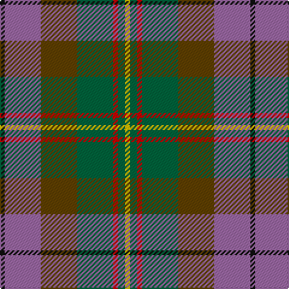

The parent of this is [Crossbill (Fashion)](/tartans/k/4/lp30/t30/g30/r4/g6/y/4/)

This was sourced from tartans-authority.  It is a [7 stripes tartan](/stripes/stripes7/).

Original link http://www.tartansauthority.com/tartan-ferret/display/6475/

## Thread count
K/4 LP30 T30 G30 R4 G6 Y/4

## Palette
Each colour and its ΔE from the base-6 reference it is a variant of.

| Colour | Shade | Base | ΔE (OKLab) |
|---|---|---|---|
| G |  `#00643C` | G  | 0.06 |
| K |  `#101010` | K  | 0.17 |
| LP |  `#9C68A4` | R  | 0.21 |
| R |  `#C80000` | R  | 0.00 |
| T |  `#604000` | G  | 0.14 |
| Y |  `#E8C000` | Y  | 0.00 |

# Sample pattern

ID: /variants/k/4/lp30/t30/g30/r4/g6/y/4-g00643c-k101010-lp9c68a4-rc80000-t604000-ye8c000/
