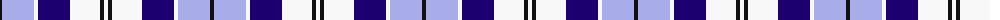
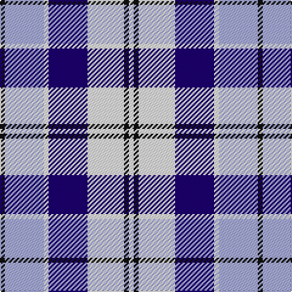

The parent of this is [Strathclyde 1975 (District)](/tartans/k/4/lp32/w4/db32/w30/k4/w/4/)

This was sourced from tartans-authority.  It is a [7 stripes tartan](/stripes/stripes7/).

Original link http://www.tartansauthority.com/tartan-ferret/display/1072/

## Thread count
K/4 LP32 W4 DB32 W30 K4 W/4

## Palette
Each colour and its ΔE from the base-6 reference it is a variant of.

| Colour | Shade | Base | ΔE (OKLab) |
|---|---|---|---|
| DB |  `#1C0070` | B  | 0.14 |
| K |  `#101010` | K  | 0.17 |
| LP |  `#A8ACE8` | W  | 0.22 |
| W |  `#F8F8F8` | W  | 0.01 |

# Sample pattern

ID: /variants/k/4/lp32/w4/db32/w30/k4/w/4-db1c0070-k101010-lpa8ace8-wf8f8f8/
