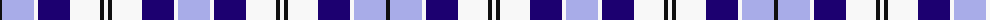

The parent of this is [Strathclyde (Official)](/tartans/k/4/lp32/w4/db32/w30/k4/w4/k4/w30/db32/w4/lp/32/)

This was sourced from register-of-tartans.  It is a [12 stripes tartan](/stripes/stripes12/).

Original link https://www.tartanregister.gov.uk/tartanDetails.aspx?ref=3980

## Thread count
K/4 LP32 W4 DB32 W30 K4 W4 K4 W30 DB32 W4 LP/32

## Palette
Each colour and its ΔE from the base-6 reference it is a variant of.

| Colour | Shade | Base | ΔE (OKLab) |
|---|---|---|---|
| DB |  `#1C0070` | B  | 0.14 |
| K |  `#101010` | K  | 0.17 |
| LN |  `#E0E0E0` | W  | 0.06 |
| LP |  `#A8ACE8` | W  | 0.22 |
| N |  `#C0C0C0` | W  | 0.16 |
| W |  `#F8F8F8` | W  | 0.01 |

ID: /variants/k/4/lp32/w4/db32/w30/k4/w4/k4/w30/db32/w4/lp/32-db1c0070-k101010-lne0e0e0-lpa8ace8-nc0c0c0-wf8f8f8/
