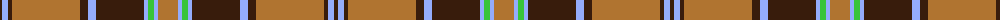

The parent of this is [Fort William (Fashion)](/tartans/k/4/lp6/k4/lt68/k8/lp8/k48/lp4/g6/lp4/lt/20/)

This was sourced from tartans-authority.  It is a [11 stripes tartan](/stripes/stripes11/).

Original link http://www.tartansauthority.com/tartan-ferret/display/4902/

## Thread count
K/4 LP6 K4 LT68 K8 LP8 K48 LP4 G6 LP4 LT/20

## Palette
Each colour and its ΔE from the base-6 reference it is a variant of.

| Colour | Shade | Base | ΔE (OKLab) |
|---|---|---|---|
| G |  `#38C438` | Y  | 0.19 |
| K |  `#381C0C` | B  | 0.21 |
| LP |  `#94ACFC` | W  | 0.24 |
| LT |  `#B07430` | R  | 0.17 |

ID: /variants/k/4/lp6/k4/lt68/k8/lp8/k48/lp4/g6/lp4/lt/20-g38c438-k381c0c-lp94acfc-ltb07430/
