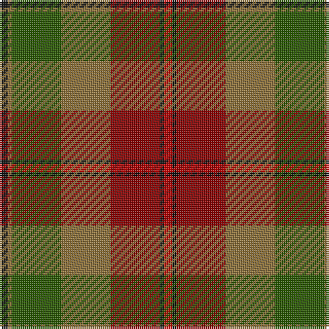

The parent of this is [PSD: Operation Iraqi Freedom (Milita](/tartans/k/4/lt2/g24/lt24/dr24/k2/r/4/)

This was sourced from tartans-authority.  It is a [7 stripes tartan](/stripes/stripes7/).

Original link http://www.tartansauthority.com/tartan-ferret/display/6877/

## Thread count
K/4 LT2 G24 LT24 DR24 K2 R/4

## Palette
Each colour and its ΔE from the base-6 reference it is a variant of.

| Colour | Shade | Base | ΔE (OKLab) |
|---|---|---|---|
| DR |  `#880000` | R  | 0.14 |
| G |  `#285800` | G  | 0.04 |
| K |  `#101010` | K  | 0.17 |
| LT |  `#8C7038` | G  | 0.18 |
| R |  `#C80000` | R  | 0.00 |

# Sample pattern

ID: /variants/k/4/lt2/g24/lt24/dr24/k2/r/4-dr880000-g285800-k101010-lt8c7038-rc80000/
