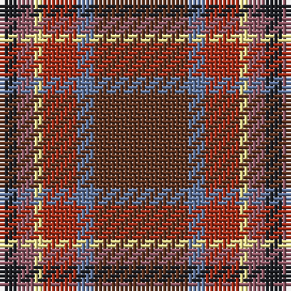

The parent of this is [Windy Meadows](/tartans/k/4/lt4/ly2/r8/b4/t/22/)

This was sourced from register-of-tartans.  It is a [6 stripes tartan](/stripes/stripes6/).

Original link https://www.tartanregister.gov.uk/tartanDetails.aspx?ref=10299

## Thread count
K/4 LT4 LY2 R8 B4 T/22

## Palette
Each colour and its ΔE from the base-6 reference it is a variant of.

| Colour | Shade | Base | ΔE (OKLab) |
|---|---|---|---|
| B |  `#5F749C` | B  | 0.17 |
| K |  `#1E2025` | B  | 0.18 |
| LT |  `#905966` | R  | 0.15 |
| LY |  `#F8E38C` | Y  | 0.11 |
| R |  `#A32D18` | R  | 0.07 |
| T |  `#5D321F` | B  | 0.18 |

# Sample pattern

ID: /variants/k/4/lt4/ly2/r8/b4/t/22-b5f749c-k1e2025-lt905966-lyf8e38c-ra32d18-t5d321f/
