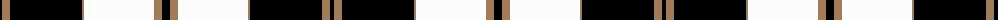
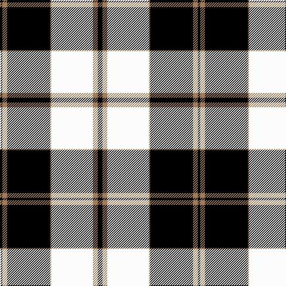

The parent of this is [Gleneagles (Fashion)](/tartans/k/4/lt8/k72/lt2/w70/lt8/k/8/)

This was sourced from tartans-authority.  It is a [7 stripes tartan](/stripes/stripes7/).

Original link http://www.tartansauthority.com/tartan-ferret/display/5030/

## Thread count
K/4 LT8 K72 LT2 W70 LT8 K/8

## Palette
Each colour and its ΔE from the base-6 reference it is a variant of.

| Colour | Shade | Base | ΔE (OKLab) |
|---|---|---|---|
| K |  `#000000` | K  | 0.00 |
| LT |  `#A07C58` | R  | 0.19 |
| W |  `#FCFCFC` | W  | 0.03 |

# Sample pattern

ID: /variants/k/4/lt8/k72/lt2/w70/lt8/k/8-k000000-lta07c58-wfcfcfc/
