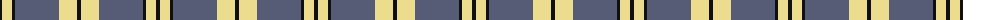

The parent of this is [Stutterheim](/tartans/k/4/ly10/k3/n44/ly18/k/4/)

This was sourced from register-of-tartans.  It is a [6 stripes tartan](/stripes/stripes6/).

Original link https://www.tartanregister.gov.uk/tartanDetails.aspx?ref=10572

## Thread count
K/4 LY10 K3 N44 LY18 K/4

## Palette
Each colour and its ΔE from the base-6 reference it is a variant of.

| Colour | Shade | Base | ΔE (OKLab) |
|---|---|---|---|
| K |  `#101010` | K  | 0.17 |
| LY |  `#ECDC8E` | Y  | 0.10 |
| N |  `#565C76` | B  | 0.11 |

# Sample pattern

ID: /variants/k/4/ly10/k3/n44/ly18/k/4-k101010-lyecdc8e-n565c76/
