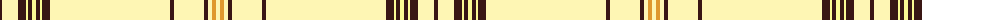

The parent of this is [UPS No.2](/tartans/k/4/lya16/k8/ly2/k4/ly4/k4/ly2/k8/lya120/k4/lya30/k4/lya4/y4/lya/4/)

This was sourced from register-of-tartans.  It is a [16 stripes tartan](/stripes/stripes16/).

Original link https://www.tartanregister.gov.uk/tartanDetails.aspx?ref=10024

## Thread count
K/4 LYa16 K8 LY2 K4 LY4 K4 LY2 K8 LYa120 K4 LYa30 K4 LYa4 Y4 LYa/4

## Palette
Each colour and its ΔE from the base-6 reference it is a variant of.

| Colour | Shade | Base | ΔE (OKLab) |
|---|---|---|---|
| K |  `#391614` | B  | 0.21 |
| LY |  `#FCFA93` | W  | 0.12 |
| LYa |  `#FEF6B4` | W  | 0.08 |
| Y |  `#DF982E` | Y  | 0.11 |

ID: /variants/k/4/lya16/k8/ly2/k4/ly4/k4/ly2/k8/lya120/k4/lya30/k4/lya4/y4/lya/4-k391614-lyfcfa93-lyafef6b4-ydf982e/
